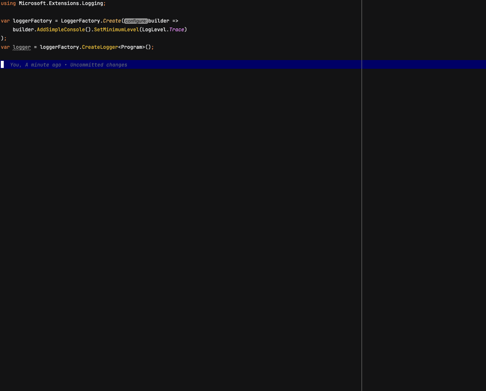

# AutoLoggerMessage

Welcome to **AutoLoggerMessage**, a source generator that automatically creates *
*[LoggerMessage](https://youtu.be/Otm8tH0Vrp0)**
methods, enabling high-performance logging..

## Demo



## Getting started

Just follow these two simple steps:

#### 1. Install the Package from [NuGet](https://www.nuget.org/packages/stbychkov.AutoLoggerMessage)

```shell
dotnet add package stbychkov.AutoLoggerMessage
```

#### 2. Enable interceptors

Interceptors can be enabled either for a specific project or globally by defining them in
the [Directory.Build.props](./src/Directory.Build.props) file

```xml

<PropertyGroup>
    <InterceptorsPreviewNamespaces>$(InterceptorsPreviewNamespaces);Microsoft.Extensions.Logging.AutoLoggerMesssage
    </InterceptorsPreviewNamespaces>
</PropertyGroup>
```

## Configuration

The source generator has a few configurable properties that control its behavior.
These properties are passed as build configurations and modify the generated code in different ways..

| Property Name                                                            | Description                                                                                                                                                            | DefaultValue |
|--------------------------------------------------------------------------|------------------------------------------------------------------------------------------------------------------------------------------------------------------------|--------------|
| `build_property.AutoLoggerMessageGenerator_GenerateInterceptorAttribute` | Specifies whether the interceptor attribute should be generated                                                                                                        | true         |
| `build_property.AutoLoggerMessageGenerator_GenerateSkipEnabledCheck`     | Sets `LogProperties.SkipEnabledCheck` to true. Determines whether to skip the logging-enabled check before invoking the log method.                                    | true         |
| `build_property.AutoLoggerMessageGenerator_GenerateOmitReferenceName`    | Sets `LogProperties.OmitReferenceName` to true. This indicates whether to prefix the name of the parameter or property to the generated name of each tag being logged. | false        |
| `build_property.AutoLoggerMessageGenerator_GenerateSkipNullProperties`   | Sets `LogProperties.SkipNullProperties` to true. Specifies whether null properties should be omitted from the log entries.                                             | false        |
| `build_property.AutoLoggerMessageGenerator_GenerateTransitive`           | Sets `LogProperties.Transitive` to true. This indicates that each property of any complex objects are expanded individually.                                           | false        |

To configure one of these properties in your project, add the following line to the .editorconfig file.

```editorconfig
build_property.AutoLoggerMessageGenerator_GenerateInterceptorAttribute = true
```

or in your project configuration file (specific or global)

```xml

<PropertyGroup>
    ...
    <AutoLoggerMessageGenerator_GenerateInterceptorAttribute>true
    </AutoLoggerMessageGenerator_GenerateInterceptorAttribute>
</PropertyGroup>
```

## Benchmarks

There are six main configurations::

1. Logger from `Microsoft.Extensions.Logging.Abstractions` package (default)
2. Source generator from `Microsoft.Extensions.Logging.Abstractions` package (default-gen)
3. Logger from `Microsoft.Extensions.Telemetry.Abstractions` package (telemetry)
4. Source generator from `Microsoft.Extensions.Telemetry.Abstractions` package (telemetry-gen)
5. Source generator from `AutoLoggerMessage` package (auto-gen)
6. Source generator from `AutoLoggerMessage` package with `Microsoft.Extensions.Logging.Abstractions` installed (
   auto-telemetry-sgen)

<details>
    <summary>Logging without any parameters</summary>

| Configuration      | Mean     | Allocated |
|--------------------|----------|-----------|
| default-gen        | 12.35 ns | -         |
| telemetry          | 19.46 ns | -         |
| default            | 23.12 ns | -         |
| auto-gen           | 27.41 ns | -         |
| telemetry-gen      | 28.32 ns | -         |
| auto-telemetry-gen | 33.97 ns | -         |

> For logging without parameters, the difference is minimal

</details>

<details>
    <summary>Logging up to 6 parameters</summary>

| Configuration      |      Mean | Allocated |
|--------------------|----------:|----------:|
| auto-gen           |  14.80 ns |         - |
| default-gen        |  25.88 ns |         - |
| auto-telemetry-gen |  85.30 ns |     144 B |
| telemetry-gen      |  87.11 ns |     144 B |
| default            |  99.18 ns |     216 B |
| telemetry          | 107.33 ns |     216 B |

> When parameters are provided, source generators outperform the other configurations in terms of execution time and memory usage.
The AutoLoggerMessage source generator adds minimal overhead.

</details>

<details>
    <summary>Logging with 7+ parameters</summary>

| Configuration      |      Mean | Allocated |
|--------------------|----------:|----------:|
| default-gen        |  20.31 ns |         - |
| telemetry-gen      |  92.35 ns |     168 B |
| default            | 107.50 ns |     248 B |
| auto-telemetry-gen | 110.17 ns |     248 B |
| auto-gen           | 112.47 ns |     248 B |
| telemetry          | 122.10 ns |     248 B |

> Due to a limitation, we fall back to the original implementation.
The results are similar, but `default-gen` configuration still uses an optimized version as it packs these parameters into a structure.
Something to address in the next release, as the usage of six or more parameters usually is quite low.

</details>

<details>
    <summary>Logging complex objects</summary>

| Configuration      |     Mean | Allocated |
|--------------------|---------:|----------:|
| auto-gen           | 18.00 ns |         - |
| default-gen        | 26.40 ns |         - |
| telemetry-gen      | 46.82 ns |         - |
| auto-telemetry-gen | 48.29 ns |         - |
| default            | 71.62 ns |      72 B |
| telemetry          | 77.28 ns |      72 B |

> For logging complex objects with a tree-like structure, we observe that source generators do not allocate memory and yield faster results.

</details>

<details>
    <summary>Logging complex objects with `[LogProperties]` enabled</summary>

| Configuration      |      Mean | Rank | Allocated |
|--------------------|----------:|-----:|----------:|
| telemetry-gen      | 680.60 ns |    1 |     144 B |
| auto-telemetry-gen | 683.07 ns |    1 |     144 B |

> Results are about the same.

</details>

<details>

</details>

## Known Limitations

* It supports only static `EventId` parameter. If you pass the explicit `EventId` parameter, which basically no one does
  as far as I can tell, it generates a new `EventId` and the existing one will be passed to the formatter state, but it
  won't be logged.
  This limitation comes from the original `LoggerMessage` generator as they don't support the explicit parameter ~~
  yet~~.
* `Log.Define` supports only 6 message
  parameters ([src](https://learn.microsoft.com/en-us/dotnet/api/microsoft.extensions.logging.loggermessage.define))
  so if you pass more than that, the default `Logger.Log(*, params object[] args)` will be executed.
* As this solution is based on interceptors, only .NET 8+ is supported

## Motivation

Source-generated logging is increasingly recognized as a modern and efficient approach.
But let’s be real, when you’ve got a mid-sized project, migrating to the new logging approach is not exactly a simple
task.
And even when starting a new project, marking every class as partial or depending on an external partial class for
logging messages can feel disconnected from the code where they are actually used.

That’s where this library comes in. It’s like a magic wand that automatically migrates all your old logging calls to the
shiny new source-generated approach with zero changes to your code.
This library handles most of the heavy lifting for you, so you can spend your time doing more important things!

I hope this is a temporary solution — maybe one day, something similar will be added out of the
box.

## How It Works

This source generator searches for all `logger.Log*` methods in your code and, based on their parameters, automatically
creates partial methods for `LoggerMessage`. It also generates a set of interceptors to forward
the logging calls to the newly generated `LoggerMessage` methods.

For more details, see the [How It Works](https://github.com/stbychkov/AutoLoggerMessage/blob/main/docs/how-it-works.md)
documentation

## Questions?

I bet you have some questions about why things are set up the way they are.
Refer to the [ADR files](./docs/ADR) for detailed explanations of the design decisions behind this package.
